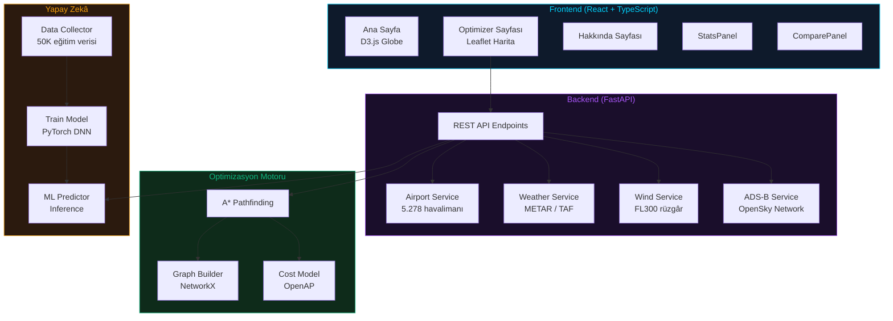

# ✈️ SkyOptimizer AI

**Yapay Zekâ Destekli Uçuş Rota Optimizasyon Sistemi**

> Sivil havacılıkta sabit hava koridorlarının yarattığı zaman ve yakıt kayıplarını minimize etmek için
> ADS-B, canlı meteoroloji ve üst seviye rüzgâr verilerini kullanarak optimum uçuş rotaları hesaplayan
> akıllı bir sistem.

---

## 🌟 Özellikler

| Özellik | Açıklama |
|---------|----------|
| 🛫 **ADS-B Canlı Takip** | OpenSky Network üzerinden gerçek zamanlı uçak pozisyonları |
| 🌦️ **Meteoroloji Entegrasyonu** | METAR, TAF raporları + üst seviye rüzgâr (FL300 jet stream) |
| 🤖 **A\* Rota Optimizasyonu** | NetworkX graf + A\* pathfinding ile rüzgâr-optimizasyonlu rota |
| 🧠 **PyTorch Derin Öğrenme** | 4 katmanlı DNN ile yakıt/süre/CO₂ tahminleri (RTX 4070 CUDA) |
| ⛽ **OpenAP Yakıt Modeli** | Gerçek uçak performans verileriyle fizik tabanlı maliyet hesabı |
| 🗺️ **İnteraktif Harita** | Leaflet dark theme harita + optimize vs standart rota karşılaştırma |
| 📊 **Dashboard** | Tasarruf sayaçları, AI vs Fizik karşılaştırma, birikimli istatistikler |
| 🌍 **5.278 Havalimanı** | OurAirports veritabanı ile küresel havalimanı desteği |

---

## 🏗️ Mimari



---

## 🚀 Kurulum

### Gereksinimler

- **Python** 3.10+
- **Node.js** 18+
- **NVIDIA GPU** (opsiyonel — CUDA 11.8+ model eğitimi için)

### 1. Repo'yu klonlayın

```bash
git clone https://github.com/<user>/deneyap-takimlasma-proje.git
cd deneyap-takimlasma-proje
```

### 2. Backend kurulumu

```bash
cd backend

# Sanal ortam oluştur
python -m venv venv
.\venv\Scripts\activate    # Windows
# source venv/bin/activate  # macOS/Linux

# Bağımlılıkları kur
pip install -r requirements.txt

# GPU ile model eğitimi (opsiyonel)
pip install torch torchvision --index-url https://download.pytorch.org/whl/cu128
```

### 3. API Anahtarları

Proje kökünde aşağıdaki dosyaları oluşturun:

**`credentials.json`**
```json
{
  "opensky_client_id": "YOUR_OPENSKY_CLIENT_ID",
  "opensky_client_secret": "YOUR_OPENSKY_CLIENT_SECRET"
}
```

**`openweatherapi.txt`**
```
YOUR_OPENWEATHERMAP_API_KEY
```

### 4. ML Model eğitimi (opsiyonel)

```bash
cd backend

# Eğitim verisi üret (50.000 satır)
.\venv\Scripts\python ml\data_collector.py

# Model eğit (GPU varsa ~1-2 dk)
.\venv\Scripts\python ml\train_model.py
```

### 5. Frontend kurulumu

```bash
cd frontend
npm install
```

### 6. Çalıştırma

```bash
# Terminal 1 — Backend (port 8000)
cd backend
.\venv\Scripts\python -m uvicorn main:app --reload --port 8000

# Terminal 2 — Frontend (port 5173)
cd frontend
npm run dev
```

Tarayıcıda `http://localhost:5173` adresine gidin.

---

## 📡 API Endpoints

| Method | Endpoint | Açıklama |
|--------|----------|----------|
| `GET` | `/health` | Sistem sağlık kontrolü |
| `GET` | `/api/status` | API limit ve cache istatistikleri |
| `GET` | `/api/airports/search?q=istanbul` | Havalimanı arama |
| `GET` | `/api/airports/{icao}` | Havalimanı detayı |
| `GET` | `/api/airports/turkey/all` | Tüm Türkiye havalimanları |
| `GET` | `/api/weather/{icao}` | METAR + TAF hava durumu |
| `GET` | `/api/winds?lat=39&lon=35` | Üst seviye rüzgâr (FL300) |
| `GET` | `/api/flights/live` | Canlı ADS-B uçuş verileri |
| `GET` | `/api/traffic` | Türkiye hava sahası trafik özeti |
| `POST` | `/api/optimize` | A* ile optimum rota hesapla |
| `POST` | `/api/compare` | Standart vs optimize rota karşılaştır |
| `POST` | `/api/predict` | AI modeli ile yakıt/süre/CO₂ tahmini |

---

## 🧠 Optimizasyon Algoritması

### A* Pathfinding

1. İki havalimanı arasında **great-circle** hattı çizilir
2. Hat üzerinde **waypoint**'ler + her iki yana **±40 NM koridor** sapma noktaları eklenir
3. **NetworkX** graf oluşturulur (41 düğüm, ~1640 kenar)
4. Her kenar için **OpenAP** yakıt modeli + rüzgâr bileşenleri ile maliyet hesaplanır
5. **Kompozit maliyet** fonksiyonu: `Yakıt %40 + Süre %35 + CO₂ %25`
6. A* algoritması en düşük maliyetli yolu bulur
7. Standart (direkt) rota ile karşılaştırılarak **tasarruf** hesaplanır

### PyTorch DNN Modeli

- **Mimari**: 7 → 256 → 128 → 64 → 32 → 3 nöron (BatchNorm + Dropout)
- **Eğitim verisi**: 50.000 örnek (CostModel ile üretilmiş)
- **Özellikler**: mesafe, rüzgâr hızı/yönü, heading, irtifa, headwind, crosswind
- **Çıktılar**: yakıt (kg), süre (dk), CO₂ (kg)
- **Cihaz**: NVIDIA RTX 4070 (CUDA)

---

## 📂 Proje Yapısı

```
deneyap-takimlasma-proje/
├── credentials.json              # OpenSky API credentials
├── openweatherapi.txt            # OpenWeatherMap API key
├── README.md
│
├── backend/
│   ├── main.py                   # FastAPI sunucu
│   ├── config.py                 # API key yönetimi
│   ├── requirements.txt
│   ├── services/
│   │   ├── airport_service.py    # 5.278 havalimanı DB
│   │   ├── adsb_service.py       # OpenSky canlı trafik
│   │   ├── weather_service.py    # METAR/TAF
│   │   ├── wind_service.py       # Üst seviye rüzgâr
│   │   └── cache_manager.py      # Cache + rate limiter
│   ├── optimization/
│   │   ├── graph_builder.py      # NetworkX graf
│   │   ├── cost_model.py         # OpenAP yakıt modeli
│   │   ├── astar.py              # A* pathfinding
│   │   └── ml_predictor.py       # PyTorch inference
│   ├── ml/
│   │   ├── data_collector.py     # Eğitim verisi üretici
│   │   ├── train_model.py        # PyTorch DNN eğitimi
│   │   ├── flight_data.csv       # 50K eğitim verisi
│   │   ├── model.pt              # Eğitilmiş model
│   │   └── scaler.pkl            # Normalizasyon parametreleri
│   └── utils/
│       └── geo.py                # Haversine, great-circle
│
└── frontend/
    ├── src/
    │   ├── App.tsx               # React Router
    │   ├── index.css             # Tailwind + cyber-aviation tema
    │   ├── pages/
    │   │   ├── HomePage.tsx      # D3.js globe hero
    │   │   ├── OptimizerPage.tsx  # Harita + optimizasyon
    │   │   └── AboutPage.tsx
    │   ├── services/
    │   │   └── api.ts            # TypeScript API client
    │   └── components/ui/
    │       ├── StatsPanel.tsx     # Birikimli tasarruf sayaçları
    │       ├── ComparePanel.tsx   # AI vs Fizik karşılaştırma
    │       ├── hero-globe.tsx     # Globe hero bileşeni
    │       └── wireframe-dotted-globe.tsx  # D3.js dönen dünya
    └── package.json
```

---

## 🔧 Teknolojiler

| Katman | Teknoloji |
|--------|-----------|
| Backend | Python, FastAPI, uvicorn |
| Frontend | React 18, TypeScript, Vite, Tailwind CSS 3 |
| Harita | Leaflet, react-leaflet, CARTO dark tiles |
| Optimizasyon | NetworkX, A* pathfinding, OpenAP |
| Yapay Zekâ | PyTorch, CUDA, scikit-learn |
| Veri Kaynakları | OpenSky Network, AviationWeather.gov, OpenWeatherMap, OurAirports |
| Animasyonlar | D3.js (globe), CSS animations, Lucide icons |

---

## 📋 Proje Bilgisi

| | |
|---|---|
| **Program** | Deneyap Takımlaşma Projesi 2026 |
| **Öncelik Bölgesi** | Türkiye Hava Sahası |
| **Lisans** | MIT |

---

*SkyOptimizer AI — Daha akıllı rotalar, daha az yakıt, daha temiz gökyüzü.* ✈️🌍
